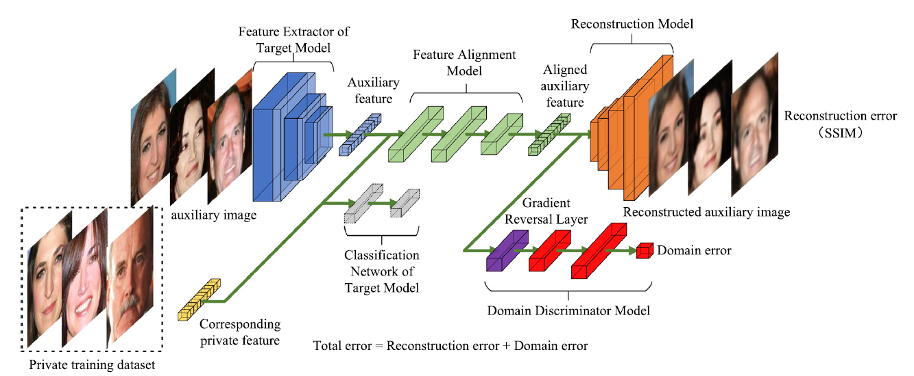
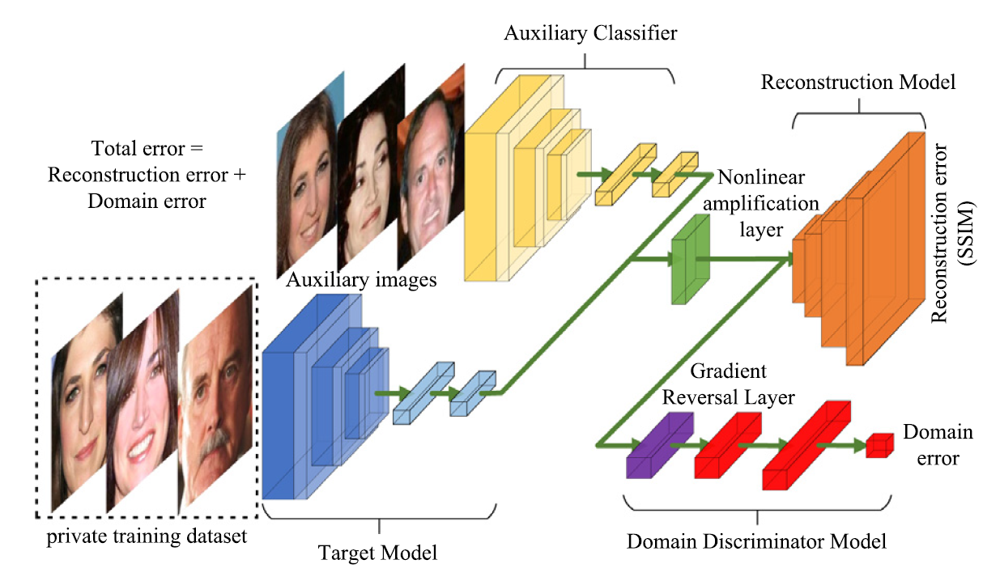

# DA-MIA - Official Pytorch Implementation

 Official code for paper: Z. Zhang and J. Huang, “Aligning the domains in cross domain model inversion attack,” Neural Networks, vol. 178, p. 106490, Oct. 2024, doi: [10.1016/j.neunet.2024.106490](https://doi.org/10.1016/j.neunet.2024.106490).





## Abstract

Model Inversion Attack reconstructs confidential training dataset from a target deep learning model. Most of the existing methods assume the adversary has an auxiliary dataset that has similar distribution with the private dataset. However, this assumption does not always hold in real-world scenarios. Since the private dataset is unknown, the domain divergence between the auxiliary dataset and the private dataset is inevitable. In this paper, we use Cross Domain Model Inversion Attack to represent the distribution divergence scenario in MIA. With the distribution divergence between the private images and auxiliary images, the distribution between the feature vectors of the private images and those of the auxiliary images is also different. Moreover, the outputted prediction vectors of the auxiliary images are also misclassified. The inversion attack is thus hard to be performed. We perform both the feature vector inversion task and prediction vector inversion task in this cross domain setting. For feature vector inversion, Domain Alignment MIA (DA-MIA) is proposed. While performing the reconstruction task, DA-MIA aligns the feature vectors of auxiliary images with the feature vectors of private images in an adversarial manner to mitigate the domain divergence between them. Thus, semantically meaningful images can be reconstructed. For prediction vector inversion, we further introduce an auxiliary classifier and propose Domain Alignment MIA with Auxiliary Classifier (DA-MIA-AC). The auxiliary classifier is pretrained by the auxiliary dataset and fine-tuned during the adversarial training stage. Thus, the misclassification problem caused by domain divergence can be solved, and the images can be reconstructed correctly. Various experiments are performed to show the advancement of our methods, the results show that DA-MIA can improve the SSIM score of the reconstructed images for up to 191%, DA-MIA-AC can increase the classification accuracy score of the reconstructed images from 9.18% to 81.32% in Cross Domain Model Inversion Attack.

## Usage

### Hardware Requirements

Any Nvidia GPU with 8GB or larger memory is enough. The experiments were initially performed on a Nvidia Tesla V100 GPU using the HPC platform of Southeast University. Later experimets were performed on a PC with a Nvidia RTX 3080 GPU. The code supports both Windows and Linux environment.

### Required Runtime Libraries

* [Anaconda](https://www.anaconda.com/download/)
* [Pytorch](https://pytorch.org/) --  `pip3 install torch torchvision --index-url https://download.pytorch.org/whl/cu129`
* [zhangzp9970/torchplus](https://github.com/zhangzp9970/torchplus) -- `pip install tplus`

The code is compatable with the latest version of all the software.

### Datasets

* MNIST -- `torchvision.datasets.MNIST(root[, train, transform, ...])`
* USPS-- `torchvision.datasets.USPS(root[, train, transform, ...])`
* FaceScrub -- can be downloaded and processed using [these scripts](https://github.com/zhangzp9970/FaceScrub). Crop the images using the official bounding box is enough.
* CelebA -- can be downloaded from their [official website](https://mmlab.ie.cuhk.edu.hk/projects/CelebA.html). Crop the images using a 128*128 center crop over the officially aligned images.

**Note: We manually selected 291 shared peoples between the FaceScrub dataset and the CelebA dataset to form the dataset used in the experiments. The selection process is hard and takes a lot of time. Unfortunately, according to the CelebA licences, copying, publishing or distributing any portion of the CelebA dataset is not allowed. To make the dataset, you should first contact the CelebA team for acquiring the name list and then select the common peoples mannually. To make it easy, we provide the name list of the facescrub common dataset in the "facescrub common name list.txt" file.**

### File Description

* main_MNIST.py -- train the MNIST classifier.
* main_USPS.py -- train the USPS classifier.

* main_FaceScrub.py -- train the FaceScrub classifier.
* main_CelebA.py -- train the CelebA classifier.

* dattack_M2U.py -- perform the DA-MIA attack. Use USPS to invert MNIST.
* dattack_U2M.py -- perform the DA-MIA attack. Use MNIST to invert USPS.

* dattack_F2C.py -- perform the DA-MIA attack. Use CelebA to invert FaceScrub.
* dattack_C2F.py -- perform the DA-MIA attack. Use FaceScrub to invert CelebA.

* dattackb_M2U.py -- perform the DA-MIA-AC attack. Use USPS to invert MNIST.
* dattackb_U2M.py -- perform the DA-MIA-AC attack. Use MNIST to invert USPS.

* dattackb_F2C.py -- perform the DA-MIA-AC attack. Use CelebA to invert FaceScrub.
* dattackb_C2F.py -- perform the DA-MIA-AC attack. Use FaceScrub to invert CelebA.

* export_M2U.py -- export images in the DA-MIA attack, M2U task.

You can easily modify the file to export images for other tasks.

## License

Copyright © 2025 Zeping Zhang

This program is free software: you can redistribute it
and/or modify it under the terms of the GNU General Public License as
published by the Free Software Foundation, either version 3 of the
License, or (at your option) any later version.

This program is distributed in the hope that it will be
useful, but WITHOUT ANY WARRANTY; without even the implied warranty of
MERCHANTABILITY or FITNESS FOR A PARTICULAR PURPOSE. See the GNU General
 Public License for more details.

You should have received a copy of the GNU General Public License along with this program. If not, see [http://www.gnu.org/licenses/](http://www.gnu.org/licenses/).

## Citation

```
 @article{Zhang_Huang_2024, 
title={Aligning the domains in cross domain model inversion attack}, 
volume={178}, 
ISSN={0893-6080}, 
DOI={10.1016/j.neunet.2024.106490}, 
journal={Neural Networks}, 
author={Zhang, Zeping and Huang, Jie}, 
year={2024}, 
month=oct, 
pages={106490} 
}
```

## Acknowledgements

We would like to thank Yueming Yin and Prof. Haifeng Hu for their useful discussions on adversarial training and feature visualization. We would also like to thank the Big Data Center of Southeast University for providing the facility support on the numerical calculations in this paper.

Part of the code in this repository is from the [easydl](https://pypi.org/project/easydl/) project from Tsinghua University, we would like to thank them for their effort in developing the code.
